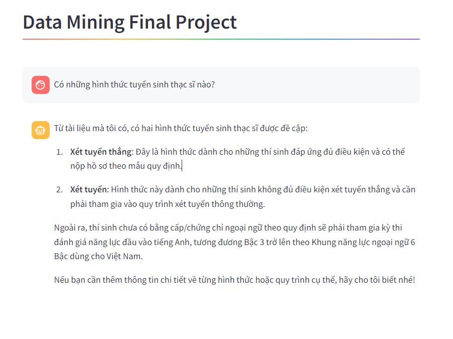

# data-mining-final_rag

This is the demo UI for our RAG project 

# Reproduce:
## Requirements:
- Llamaindex and related neccessary packages 
- Docker installed
- Opensearch installed
- Streamlit installed
- Huggingface datasets installed
  
## Steps:

- Set Open AI key as environment variable: 
  - "set OPENAI_API_KEY=sk-..." for Windows
  - "export OPENAI_API_KEY=sk-..." for Linux/Mac
- Run the streamlit using: ` streamlit run home.py `

# Evaluation
You can re-eval the rag by run the notebook `eval.ipynb`, make sure to include the api key in the code